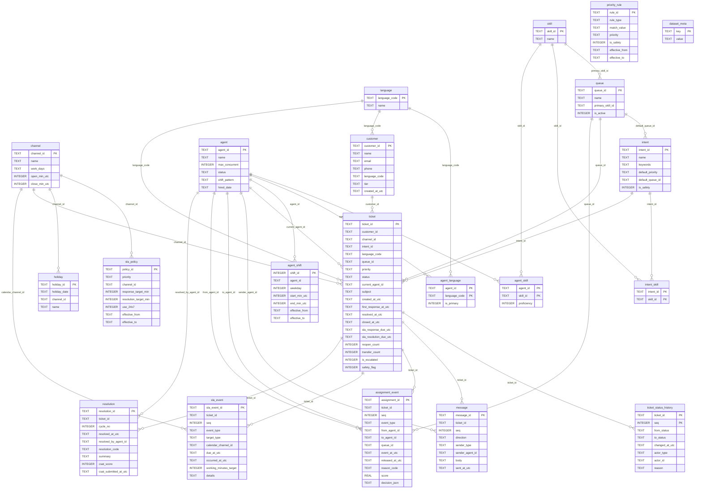

# ER Diagram (Mermaid)

```mermaid
erDiagram
  language {
    TEXT language_code PK
    TEXT name
  }
  channel {
    TEXT channel_id PK
    TEXT name
    TEXT work_days
    INTEGER open_min_utc
    INTEGER close_min_utc
  }
  skill {
    TEXT skill_id PK
    TEXT name
  }
  queue {
    TEXT queue_id PK
    TEXT name
    TEXT primary_skill_id
    INTEGER is_active
  }
  intent {
    TEXT intent_id PK
    TEXT name
    TEXT keywords
    TEXT default_priority
    TEXT default_queue_id
    INTEGER is_safety
  }
  intent_skill {
    TEXT intent_id PK
    TEXT skill_id PK
  }
  priority_rule {
    TEXT rule_id PK
    TEXT rule_type
    TEXT match_value
    TEXT priority
    INTEGER is_safety
    TEXT effective_from
    TEXT effective_to
  }
  sla_policy {
    TEXT policy_id PK
    TEXT priority
    TEXT channel_id
    INTEGER response_target_min
    INTEGER resolution_target_min
    INTEGER use_24x7
    TEXT effective_from
    TEXT effective_to
  }
  holiday {
    TEXT holiday_id PK
    TEXT holiday_date
    TEXT channel_id
    TEXT name
  }
  agent {
    TEXT agent_id PK
    TEXT name
    INTEGER max_concurrent
    TEXT status
    TEXT shift_pattern
    TEXT hired_date
  }
  agent_skill {
    TEXT agent_id PK
    TEXT skill_id PK
    INTEGER proficiency
  }
  agent_language {
    TEXT agent_id PK
    TEXT language_code PK
    INTEGER is_primary
  }
  agent_shift {
    INTEGER shift_id PK
    TEXT agent_id
    INTEGER weekday
    INTEGER start_min_utc
    INTEGER end_min_utc
    TEXT effective_from
    TEXT effective_to
  }
  customer {
    TEXT customer_id PK
    TEXT name
    TEXT email
    TEXT phone
    TEXT language_code
    TEXT tier
    TEXT created_at_utc
  }
  ticket {
    TEXT ticket_id PK
    TEXT customer_id
    TEXT channel_id
    TEXT intent_id
    TEXT language_code
    TEXT queue_id
    TEXT priority
    TEXT status
    TEXT current_agent_id
    TEXT subject
    TEXT created_at_utc
    TEXT first_response_at_utc
    TEXT resolved_at_utc
    TEXT closed_at_utc
    TEXT sla_response_due_utc
    TEXT sla_resolution_due_utc
    INTEGER reopen_count
    INTEGER transfer_count
    INTEGER is_escalated
    INTEGER safety_flag
  }
  ticket_status_history {
    TEXT ticket_id PK
    INTEGER seq PK
    TEXT from_status
    TEXT to_status
    TEXT changed_at_utc
    TEXT actor_type
    TEXT actor_id
    TEXT reason
  }
  message {
    TEXT message_id PK
    TEXT ticket_id
    INTEGER seq
    TEXT direction
    TEXT sender_type
    TEXT sender_agent_id
    TEXT body
    TEXT sent_at_utc
  }
  assignment_event {
    TEXT assignment_id PK
    TEXT ticket_id
    INTEGER seq
    TEXT event_type
    TEXT from_agent_id
    TEXT to_agent_id
    TEXT queue_id
    TEXT event_at_utc
    TEXT released_at_utc
    TEXT reason_code
    REAL score
    TEXT decision_json
  }
  sla_event {
    TEXT sla_event_id PK
    TEXT ticket_id
    INTEGER seq
    TEXT event_type
    TEXT target_type
    TEXT calendar_channel_id
    TEXT due_at_utc
    TEXT occurred_at_utc
    INTEGER working_minutes_target
    TEXT details
  }
  resolution {
    TEXT resolution_id PK
    TEXT ticket_id
    INTEGER cycle_no
    TEXT resolved_at_utc
    TEXT resolved_by_agent_id
    TEXT resolution_code
    TEXT summary
    INTEGER csat_score
    TEXT csat_submitted_at_utc
  }
  dataset_meta {
    TEXT key PK
    TEXT value
  }
  skill ||--o{ queue : "primary_skill_id"
  queue ||--o{ intent : "default_queue_id"
  skill ||--o{ intent_skill : "skill_id"
  intent ||--o{ intent_skill : "intent_id"
  channel ||--o{ sla_policy : "channel_id"
  channel ||--o{ holiday : "channel_id"
  skill ||--o{ agent_skill : "skill_id"
  agent ||--o{ agent_skill : "agent_id"
  language ||--o{ agent_language : "language_code"
  agent ||--o{ agent_language : "agent_id"
  agent ||--o{ agent_shift : "agent_id"
  language ||--o{ customer : "language_code"
  agent ||--o{ ticket : "current_agent_id"
  queue ||--o{ ticket : "queue_id"
  language ||--o{ ticket : "language_code"
  intent ||--o{ ticket : "intent_id"
  channel ||--o{ ticket : "channel_id"
  customer ||--o{ ticket : "customer_id"
  ticket ||--o{ ticket_status_history : "ticket_id"
  agent ||--o{ message : "sender_agent_id"
  ticket ||--o{ message : "ticket_id"
  queue ||--o{ assignment_event : "queue_id"
  agent ||--o{ assignment_event : "to_agent_id"
  agent ||--o{ assignment_event : "from_agent_id"
  ticket ||--o{ assignment_event : "ticket_id"
  channel ||--o{ sla_event : "calendar_channel_id"
  ticket ||--o{ sla_event : "ticket_id"
  agent ||--o{ resolution : "resolved_by_agent_id"
  ticket ||--o{ resolution : "ticket_id"
```
